# Artificial Intelligence 2

# Exercise 1

## Name: Nikolaos Iliopoulos

## AM: 1115201800332

---

> **A classifier to identify anti-vax | pro-vax tweets using softmax regression**

## Libraries

- **pandas**
- **sklearn**
- **nltk**
- **numpy**
- **matplotlib**

---

## Softmax Regration Function

In order to do softmax regration i used the LogisticRegression function from sklearn.linear_model library.
Arguments:

- **multi_class** = "multinomial"
  > This argument is for the softmax regression.
- **max_iter** = 5000
  > Increase maximum iterations so that the model does not get stuck.

---

## Text Vectorizers

- **CountVectorizer()**
  > CountVectorizer is used to count the number of times a word appears in a document.
  <!-- >
  > Words in the Vocabulary = *2199*
  > |  Scores   |    Training Set    |   Validation Set   |
  > |-----------|--------------------|--------------------|
  > |     F1    | 0.7995  | 0.7109 |
  > |   Recall  | 0.8029 | 0.7151 |
  > | Precision | 0.8026 | 0.7099 | -->
- **TfidfVectorizer()**
  > TfidfVectorizer is used to count the number of times a word appears in a document and then normalize the counts by the inverse document frequency.
  <!-- >
  > Words in the Vocabulary = *2199*
  > |  Scores   |    Training Set    |   Validation Set   |
  > |-----------|--------------------|--------------------|
  > |     F1    | 0.7738 | 0.7137 |
  > |   Recall  | 0.7806 | 0.7204 |
  > | Precision | 0.7809 | 0.7159 | -->
- **HashingVectorizer()**
  > HashingVectorizer is used to convert a collection of text documents to a matrix of token occurrences.
  <!-- >
  > n_features = *2048*
  > |  Scores   |    Training Set    |   Validation Set   |
  > |-----------|--------------------|--------------------|
  > |     F1    | 0.7403 | 0.6840 |
  > |   Recall  | 0.7493 | 0.6919 |
  > | Precision | 0.7475 | 0.6861 | -->

**I concluded that the TfidfVectorizer() is the best option for this task.**

---

For the CountVectorizer() and the TfidfVectorizer() i used the following arguments:

- **strip_accents** = 'unicode'
  > This argument is used to remove accents from the text. It reduces the dimensionality of the data.
- **ngram_range** = (1, 1)
  > This argument is used to create n-grams. It is used to create unigrams and bigrams.
- **min_df** = 10 or **min_df** = 0.001
  > **int** value means that the word must appear in at least 10 tweets to be included in the vocabulary.
  > **float** value means that the word must appear in at least 0.001% of the tweets to be included in the vocabulary.
  > Those 2 values worked the best for my case.
- **stop_words** = text.ENGLISH_STOP_WORDS
  > This argument is used to remove stop words.
- **lowercase** = True
  > This argument is used to convert all words to lowercase.

---

Generally i show small changes in the results by changing the arguments.
Only the **min_df** argument did good by removing the words that appeared in less documents, that are not important for the classification.

## Pre-Processing

I used pre-processing but i did not see any significant improvement in the results.
The pre-processing is done by doing the following things:

- **Removing Url**
  > Url's are not important for the classification. So i removed them. It may seem that it is not impoving the results but it is cause the min_df argument is set to 10 and every link is possibly not more than 10 times in the document.
- **Removing Puntuations**
  > Puntuations are not giving anything meaninful information. So i removed them.
- **Removing Emojis**
  > Emojis are not giving anything meaninful information. So i removed them.
- **Tokenization && Removing Extra Spaces**
  > Tokenization is the process of breaking a string of text into a list of substrings.
- **Lemmatization**
  > Lemmatization is the process of finding the base form of a word. I tried stemming but sometimes it did not work properly.

---

## Scores && Results

In the start the model was **overfitting** with 32656 words in the Vocabulary.

- with CountVectorizer().

  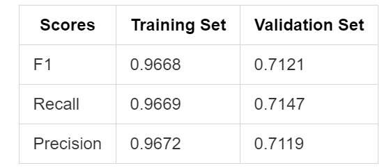
  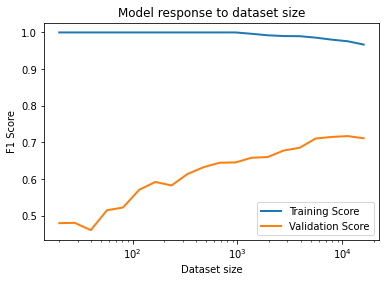 

- with HashingVectorizer().

  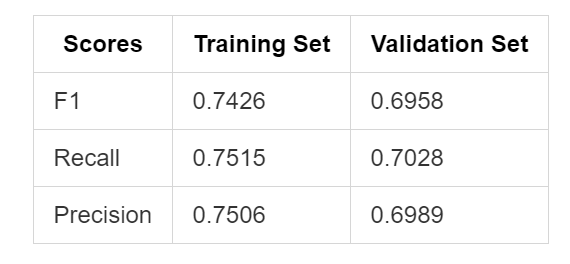
  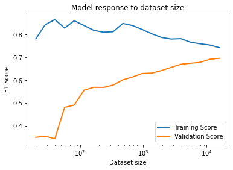 

- with TfidfVectorizer().

  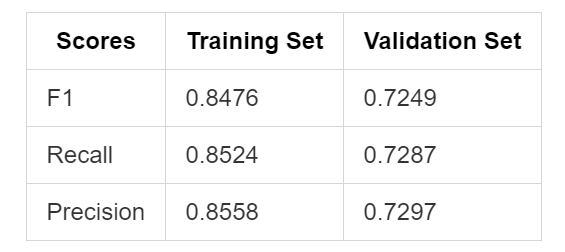
  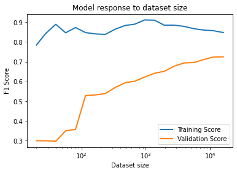 

> I choose the TfidfVectorizer() because it keeps the scores high and the gap between the train scores and the validation scores low.

---

**Then i removed the stopwords, made the words lowercase, strip_accents = 'unicode', ngram_range=(1,1), min_df=0.001**

  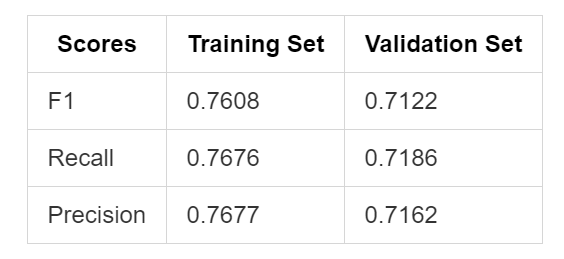
  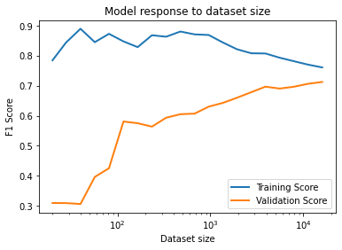 

**I tried min_df=0.01 the gap in the f1 score was lower but the scores where also a little bit lower so i did not choose it**

  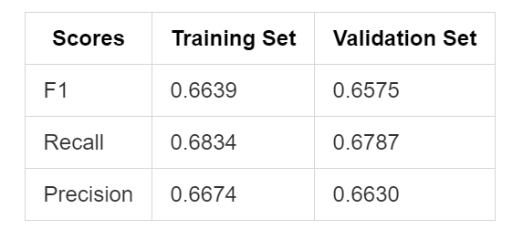
  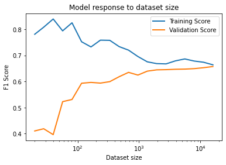 

---

**In the end I apply pre-processing to the data**. The scores didn't improve as expected.
Words in the Vocabulary = **1469** from the 32656 in the start.

  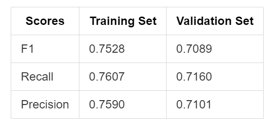
  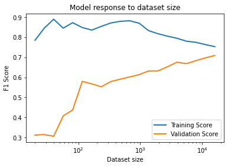 

## Remarks

- I notice that the smaller the vocabulary size the vectorizer produces (it has only the most common and important words) the closer the f1 score of the train and the validation set is. No overfit. **But a very small vocabulary size can cause the model to drop performance.**
- I thought that the pre-processing will help a lot in the case of overfitting. But it didn't.
- I noticed that as the Datasize is increasing in the learning curve the training set scores are getting lower, **cause the model cannot remember all the exambles**.
- Maybe the decision to lowercase the words was not the best. Cause the tweets have some emotions and by removing the lowercases words it loss the meaning of the words. But i didnt see any significant improvement in the results so i decided to make them lowercase to reduce the vocabulary size.
